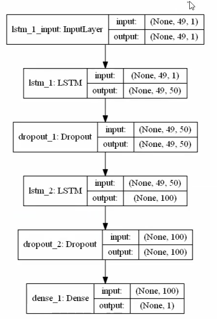

### Instruction

This code is for the Machine Learning  predicting solar penal power in TETB, UNSW 2019. 

All the raw data are in [data/2019](./data/2019) folder.

Cleaning the data with '[merged_2019TETB.py](merged_2019TETB.py)'.

All the configs are in '[setting2json.py](setting2json.py)'.

The main program is '[run.py](run.py)'.

The models are saved in '[saved_models](saved_models)'.

All the results are shown in '[output](output)'  
